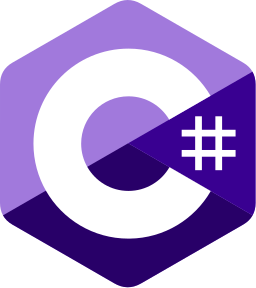

## Profile

I am a full-stack developer with 10+ years of experience in web development and a wide knowledge of the most used programming languages. I work efficiently with many modern software stacks.

  
<i aria-hidden="true">👨‍💻</i>Working Experience

<section>
### Full-Stack Developer at [Docebo S.p.A](https://www.docebo.com)

<i aria-hidden="true">🗓️</i>from 2020-09 to present | <i aria-hidden="true">🏡</i>full remote

I started my experience at Docebo in the integration team, working on the maintenance of Single Sign On (SSO) integrations. After that, I joined the Platform as a Service (PaaS) team, where we developed a completely new serverless infrastructure to enable the transition from a single product to a suite of multiple products. More recently, I have been working on extracting SSO integrations from the monolithic PHP project to a set of microservices written in GO. I am currently part of the embedding team and am developing a browser extension aimed at enhancing the learning platform experience.

Technologies used:

- [PHP](https://www.php.net)
-  [Typescript](https://www.typescriptlang.org)
-  [GO](https://go.dev)
-  [MySQL](https://www.mysql.com)
-  [PostgreSQL](https://www.postgresql.org)
-  [AWS](https://aws.amazon.com/)
-  [Yii](https://www.yiiframework.com)
-  [Angular](https://angular.dev)
-  [NestJS](https://nestjs.com)

***
</section>

<section>
### Technical Team Leader at [Altaformazione S.r.l](https://www.altaformazione.it)

<i aria-hidden="true">🗓️</i>from 2019-05 to 2020-09 | _<i aria-hidden="true">📍</i>[via Pietro Filargo 36, 20143, Milano, Italy](https://www.openstreetmap.org/#map=18/45.443087/9.166283)_

I led a team of four developers with different seniorities, together we developed several customisations and plugins for the Moodle Learning Management System.

Technologies used:

-  [PHP](https://www.php.net)
-  Javascript
-  [MySQL](https://www.mysql.com)
-  [Docker](https://www.docker.com)
-  [DigitalOcean](https://www.digitalocean.com)
-  [Moodle](https://moodle.org)
-  [Laravel](https://laravel.com)
-  [Vue.js](https://vuejs.org)

***
</section>

<section>
### Full-Stack Developer at [Altaformazione S.r.l](https://www.altaformazione.it)

<i aria-hidden="true">🗓️</i>from 2016-06 to 2019-05 | _<i aria-hidden="true">📍</i>[via Pietro Filargo 36, 20143, Milano, Italy](https://www.openstreetmap.org/#map=18/45.443087/9.166283)_

I have been involved in the development of an internal Javascript framewok to support the production of [SCORM](https://adlnet.gov/past-projects/scorm) and [AICC](https://en.wikipedia.org/wiki/Aviation_Industry_Computer-Based_Training_Committee) e-learning projects. Then, I developed a set of plugins for the Moodle Learning Management System.

Technologies used:

-  [PHP](https://www.php.net)
-  Javascript
-  [MySQL](https://www.mysql.com)
-  [Docker](https://www.docker.com)
-  [Moodle](https://moodle.org)
-  [Laravel](https://laravel.com)
-  Angular.js

***
</section>

<section>
### Software Development Consultant at [Marsi S.r.l.](https://www.marsi.net)

<i aria-hidden="true">🗓️</i>from 2013-12 to 2016-06 | _<i aria-hidden="true">📍</i>[viale Sarmazzano 3/3, 20070 Vizzolo Predabissi (MI), Italy](https://www.openstreetmap.org/#map=18/45.366567/9.340466)_

I joined the company as a consultant to help with the ongoing projects. I had the opportunity to work in many areas including health-care, industrial, airport and digital signage.

Technologies used:

-  C#
-  [Python](https://www.python.org)
-  [PHP](https://www.php.net)
-  Javascript
-  [.NET](https://dotnet.microsoft.com)
-  [SQLite](https://www.sqlite.org)
-  [Laravel](https://laravel.com)
-  Angular.js

</section>

  
<i aria-hidden="true">🔬</i>Education

### Secondary School  Diploma in Electronics and Telecommunications at [ITIS G. Feltrinelli](https://www.itisfeltrinelli.edu.it)

<i aria-hidden="true">🗓️</i>from 2004-09 to 2009-06 | _<i aria-hidden="true">📍</i>[piazza Tito Lucrezio Caro, 8, Milano, Italy](https://www.openstreetmap.org/#map=18/45.448620/9.183331)_

  
<i aria-hidden="true">📎</i>Side Projects

<section>
### Motorcycle Data Engineer

<i aria-hidden="true">🗓️</i>from 2020-09 to present

I have a passion: motorbikes. Some years ago, I have started my experience as Data Engineer helping other riders to optimize the setup of their bikes and, in 2021, I had the chance to work in a professional team in the contex of the [World SBK Championship](https://www.worldsbk.com).

***
</section>

<section>
### Sound Engineer

<i aria-hidden="true">🗓️</i>from 2011-01 to 2024-12

In 2011 I put up a web radio project with a couple of friends, that gave me the possibility to make some interesting experiments with web technologies applied to audio and video streaming.

</section>

