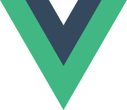

## Profilo

Sono uno sviluppatore full-stack con oltre 10 anni di esperienza nello sviluppo web e un'ampia conoscenza dei linguaggi di programmazione più utilizzati. Lavoro in modo efficiente con diversi stack software moderni.

  
<i aria-hidden="true">👨‍💻</i>Esperienza Lavorativa

<section>
### Full-Stack Developer presso [Docebo S.p.A](https://www.docebo.com)

<i aria-hidden="true">🗓️</i>da 2020-09 ad oggi | <i aria-hidden="true">🏡</i>remoto

Ho iniziato la mia esperienza in Docebo nel team integration occupandomi della manutenzione delle integrazioni Single Sign On (SSO), dopo di che, sono entrato a far parte del team Platform as a Service (PaaS) dove abbiamo sviluppato un'infrastruttura serverless completamente nuova, per consentire la transizione da un singolo prodotto a una suite di prodotti multipli. Più recentemente mi sono occupato dell'estrazione delle integrazioni SSO dal progetto monolite scritto PHP ad un set di micro-servizi scritti in GO. Attualmente faccio parte del team che si occupa dei embedding e sto sviluppando un'estensione browser volta a potenziare l'esperienza della piattaforma di apprendimento.

Tecnologie utilizzate:

- [PHP](https://www.php.net)
-  [Typescript](https://www.typescriptlang.org)
-  [GO](https://go.dev)
-  [MySQL](https://www.mysql.com)
-  [PostgreSQL](https://www.postgresql.org)
-  [AWS](https://aws.amazon.com/)
-  [Yii](https://www.yiiframework.com)
-  [Angular](https://angular.dev)
-  [NestJS](https://nestjs.com)

***
</section>

<section>
### Technical Team Leader presso [Altaformazione S.r.l](https://www.altaformazione.it)

<i aria-hidden="true">🗓️</i>da 2019-05 a 2020-09 | _<i aria-hidden="true">📍</i>[via Pietro Filargo 36, 20143, Milano, Italy](https://www.openstreetmap.org/#map=18/45.443087/9.166283)_

Ho guidato un team di quattro sviluppatori con seniority differenti, insieme, abbiamo sviluppato diverse personalizzazioni e plugin per il sistema di gestione dell'apprendimento Moodle.

Tecnologie utilizzate:

-  [PHP](https://www.php.net)
-  Javascript
-  [MySQL](https://www.mysql.com)
-  [Docker](https://www.docker.com)
-  [DigitalOcean](https://www.digitalocean.com)
-  [Moodle](https://moodle.org)
-  [Laravel](https://laravel.com)
-  [Vue.js](https://vuejs.org)

***
</section>

<section>
### Full-Stack Developer presso [Altaformazione S.r.l](https://www.altaformazione.it)

<i aria-hidden="true">🗓️</i>da 2016-06 a 2019-05 | _<i aria-hidden="true">📍</i>[via Pietro Filargo 36, 20143, Milano, Italy](https://www.openstreetmap.org/#map=18/45.443087/9.166283)_

Ho partecipato allo sviluppo di un framework Javascript interno per supportare la produzione di progetti e-learning [SCORM](https://adlnet.gov/past-projects/scorm) e [AICC](https://en.wikipedia.org/wiki/Aviation_Industry_Computer-Based_Training_Committee). Inoltre, ho sviluppato una suite di plugin per il sistema di gestione dell'apprendimento Moodle.

Tecnologie utilizzate:

-  [PHP](https://www.php.net)
-  Javascript
-  [MySQL](https://www.mysql.com)
-  [Docker](https://www.docker.com)
-  [Moodle](https://moodle.org)
-  [Laravel](https://laravel.com)
-  Angular.js

***
</section>

<section>
### Consulente per lo Sviluppo Software presso [Marsi S.r.l.](https://www.marsi.net)

<i aria-hidden="true">🗓️</i>da 2013-12 a 2016-06 | _<i aria-hidden="true">📍</i>[viale Sarmazzano 3/3, 20070 Vizzolo Predabissi (MI), Italy](https://www.openstreetmap.org/#map=18/45.366567/9.340466)_

Sono entrato in azienda come consulente per contribuire ai progetti in corso. Ho avuto l'opportunità di lavorare in molti settori, tra cui quello sanitario, industriale, aeroportuale e della segnaletica digitale.

Tecnologie utilizzate:

-  C#
-  [Python](https://www.python.org)
-  [PHP](https://www.php.net)
-  Javascript
-  [.NET](https://dotnet.microsoft.com)
-  [SQLite](https://www.sqlite.org)
-  [Laravel](https://laravel.com)
-  Angular.js

</section>

  
<i aria-hidden="true">🔬</i>Istruzione

### Diploma in Elettronica e Telecomunicazioni presso [ITIS G. Feltrinelli](https://www.itisfeltrinelli.edu.it)

<i aria-hidden="true">🗓️</i>da 2004-09 a 2009-06 | _<i aria-hidden="true">📍</i>[piazza Tito Lucrezio Caro, 8, Milano, Italy](https://www.openstreetmap.org/#map=18/45.448620/9.183331)_

  
<i aria-hidden="true">📎</i>Altri Progetti

<section>
### Tecnico Acquisizione Dati

<i aria-hidden="true">🗓️</i>da 2020-09 a present

Ho una passione: le moto. Alcuni anni fa, ho iniziato la mia esperienza con i sistemi di aquisizione dati aiutando altri piloti a ottimizzare la messa a punto delle loro moto e, nel 2021, ho avuto l'opportunità di lavorare in un team professionista nell'ambito del [World SBK Championship](https://www.worldsbk.com).

***
</section>

<section>
### Tecnico del Suono

<i aria-hidden="true">🗓️</i>da 2011-01 a 2024-12

Nel 2011, con alcuni amici, ho messo in piedi il progetto di una web radio, che mi ha dato la possibilità di fare alcuni interessanti esperimenti con le tecnologie web applicate allo streaming audio e video.
</section>

